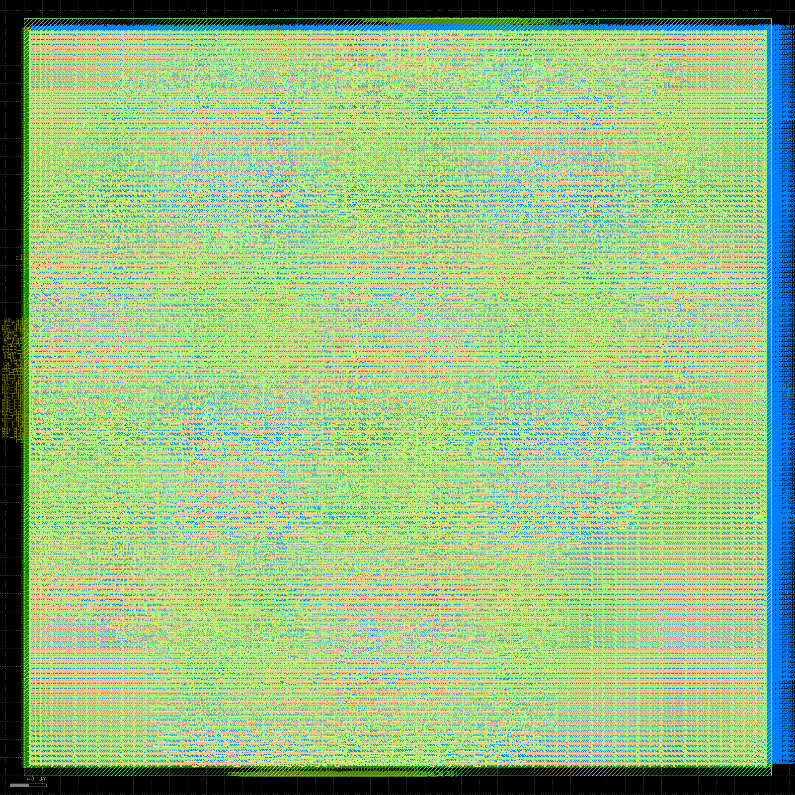
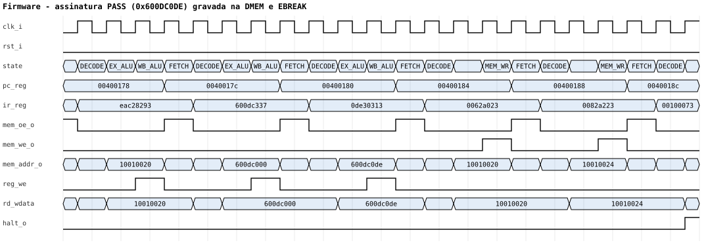
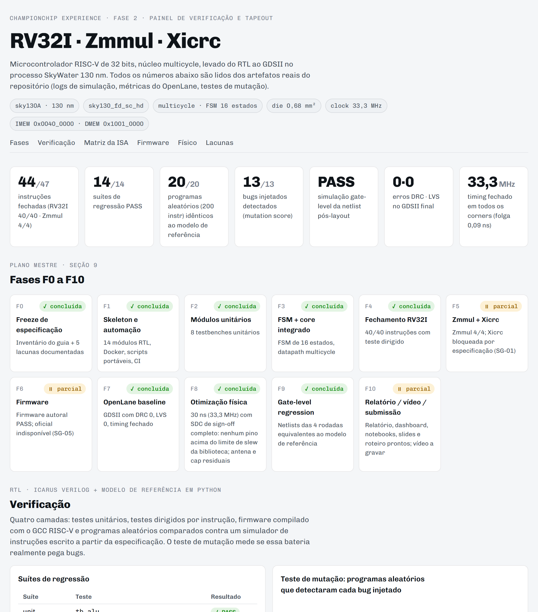

# 🔲 ChampionCHIP RV32 — Processador RISC-V do RTL ao Silício

### SystemVerilog · RISC-V (RV32I + Zmmul + Xicrc) · Icarus Verilog · Verilator · Yosys · OpenLane 2 · SkyWater SKY130 · Python · Docker · GitHub Actions

[](https://github.com/Yuri-Fernando/championchip-rv32-sky130/actions/workflows/ci.yml)


## Status

🟢 **Concluído no escopo da Fase 2** — núcleo verificado, fechado fisicamente
(GDSII com DRC 0 e LVS 0) e validado em simulação gate-level. Três instruções
(extensão Xicrc) aguardam parâmetros que o guia oficial não publicou.

## Descrição / Contexto

**Competição de projeto de circuitos integrados — ChampionCHIP eXperience, Fase 2.**

Microcontrolador RISC-V de 32 bits com núcleo **multicycle**, projetado em
SystemVerilog e levado de ponta a ponta: arquitetura → RTL → verificação em
camadas → firmware → síntese → posicionamento e roteamento → verificação de
sign-off → **GDSII** no processo **SkyWater SKY130 (130 nm)**, com o OpenLane 2.

O guia da competição pede 47 instruções (RV32I + multiplicação Zmmul + CRC
customizado Xicrc), testbench por módulo, firmware executando, fluxo físico
completo, relatório e vídeo. Ele também deixa **lacunas de especificação**
(parâmetros do CRC, macro física das memórias, pinagem, polaridade do reset,
firmware oficial). A regra do projeto foi nunca preencher uma lacuna por
suposição: cada uma está isolada no código, marcada e documentada em
[`SPEC_GAPS.md`](docs/governance/SPEC_GAPS.md).

O projeto seguiu um **Plano Mestre de Engenharia** com 11 fases (F0–F10), cada
uma encerrada por um gate de evidência (teste verde, log ou métrica).

> **Sobre o nome:** `championchip-rv32-sky130` junta a competição, o núcleo
> (RISC-V de 32 bits) e o processo de fabricação (SkyWater 130 nm) — os três
> fatos que definem o projeto.

---

## 🎯 Objetivo

- Projetar um núcleo RISC-V multicycle **simples, modular e verificável**,
  priorizando área e risco baixos em vez de desempenho (sem pipeline, cache ou
  forwarding);
- Fechar **40/40 instruções RV32I** e **4/4 Zmmul** com evidência reproduzível;
- Provar a cadeia completa de firmware: **GCC RISC-V → ELF → hex → execução no processador**;
- Levar o núcleo ao **GDSII** com sign-off limpo (DRC, LVS, timing em todos os corners);
- Demonstrar que a **netlist pós-layout** se comporta igual ao modelo de referência;
- Medir a **força da própria verificação** (teste de mutação), não apenas contar testes verdes.

---

## 🔬 Linha de Pesquisa / Desenvolvimento

- Arquitetura de computadores (RISC-V, microarquitetura multicycle, FSM de controle);
- Projeto digital em SystemVerilog sintetizável;
- Verificação funcional: testes dirigidos, **teste diferencial randomizado contra
  modelo de referência independente**, **teste de mutação**;
- Fluxo RTL-to-GDSII open source (Yosys, OpenROAD, Magic, KLayout, Netgen);
- Análise estática de timing multi-corner (processo, temperatura, tensão);
- Simulação gate-level com modelos de células padrão;
- Infraestrutura reproduzível para EDA (Docker, CI, scripts portáveis).

---

## 🏗️ Arquitetura

### Sistema

```text
Top-level (clk_i · rst_i)
   ↓
Núcleo RV32I · Zmmul · Xicrc  (multicycle, FSM de 16 estados)
   ↓  addr · oe · we · bw[3:0] · wdata  /  rdata
Address Decoder (roteamento MMIO, bloqueio de escrita na IMEM)
   ├─ IMEM  0x0040_0000 – 0x007F_FFFF  ROM, leitura combinacional (até 4 MB)
   └─ DMEM  0x1001_0000 – 0x1001_1FFF  SRAM síncrona, byte-enable (8 kB)
```

### Microarquitetura (FSM)

```text
FETCH → DECODE ─┬─ EX_ALU ─────────────────────────── WB_ALU ─┐
                ├─ EX_BRANCH ─────────────────────────────────┤
                ├─ EX_JUMP ─────────────────────────── WB_ALU ─┤
                ├─ MEM_ADDR ─┬─ MEM_READ → MEM_WAIT ── WB_MEM ─┤
                │            └─ MEM_WRITE ─────────────────────┤
                ├─ EX_MUL ──────────────────────────── WB_MUL ─┤
                ├─ EX_CRC ──────────────────────────── WB_CRC ─┤
                └─ SYSTEM (FENCE · ECALL · EBREAK) ────────────┘
                                                         ↓
                                                       FETCH
```

O estado **MEM_WAIT** existe porque o guia define a DMEM como síncrona (o dado
de um load só chega um ciclo depois). Uma instrução de ALU leva 4 ciclos, um
load 6 e um branch 3. A ALU é compartilhada entre operações, cálculo de
endereço, alvo de desvio e AUIPC.

### Módulos RTL

| Módulo | Função | Testbench |
|---|---|---|
| `regfile.sv` | 32 × 32 bits, x0 fixo em zero, 2 leituras e 1 escrita | `tb_regfile` |
| `alu.sv` | 11 operações (ADD … SRA, PASSB) | `tb_alu` |
| `imm_gen.sv` | imediatos I/S/B/U/J com sign-extend | `tb_imm_gen` |
| `branch_cmp.sv` | 6 condições de desvio (signed e unsigned) | `tb_branch_cmp` |
| `mult_unit.sv` | MUL / MULH / MULHSU / MULHU (produto de 64 bits) | `tb_mult_unit` |
| `crc_unit.sv` | CRCB / CRCH / CRCW — estrutural e parametrizada (BLOCKED-XICRC) | `tb_crc_unit` |
| `lsu.sv` | load/store byte/half/word, sign/zero-extend, byte-write | `tb_lsu` |
| `control_unit.sv` | decode + FSM de 16 estados | `tb_isa_*` |
| `rv32_core.sv` | integração do datapath e registradores de estágio | `tb_isa_*`, `tb_random` |
| `address_decoder.sv` · `imem.sv` · `dmem.sv` | memórias e roteamento | `tb_address_decoder` |
| `soc_top.sv` · `chip_top.sv` | top funcional de simulação e top físico | firmware, gate-level |

Detalhes: [`docs/architecture/overview.md`](docs/architecture/overview.md).

---

## ⚙️ Funcionamento

**Execução de uma instrução**

1. **FETCH** — o PC endereça a IMEM e a instrução é capturada no IR;
2. **DECODE** — lê os registradores-fonte, gera o imediato e escolhe o caminho;
3. **EXECUTE** — ALU, comparador de desvio, multiplicador, CRC ou cálculo de endereço;
4. **MEMÓRIA** (loads/stores) — acesso à DMEM, com espera de um ciclo nos loads;
5. **WRITE-BACK** — o resultado é gravado em `rd`; o PC é atualizado uma única vez por instrução.

**Do RTL ao silício**

```text
RTL (SystemVerilog)
   ↓  lint (Verilator) · regressão (Icarus) · mutação
Síntese (Yosys)  →  Floorplan  →  Posicionamento  →  Árvore de clock
   ↓
Roteamento global e detalhado  →  Reparo de slew/cap/antena
   ↓
STA em 9 corners · DRC (KLayout + Magic) · LVS (Netgen)
   ↓
GDSII + netlist gate-level  →  simulação gate-level (firmware + aleatórios)
```

---

## 🧠 Verificação / Modelagem

A verificação foi construída em camadas, cada uma cobrindo um tipo diferente de risco:

| Camada | O que prova | Resultado |
|---|---|---|
| Testes unitários | cada bloco isolado | 8/8 |
| Testes por instrução | as 44 instruções no SoC, com scoreboard no banco de registradores | 4/4 suítes |
| Firmware real | `riscv64-unknown-elf-gcc -march=rv32im` → grava `0x600DC0DE` e executa EBREAK | PASS |
| **Diferencial randomizado** | programas aleatórios no RTL e num **modelo de referência** em Python | 20 × 200 instruções idênticos |
| **Teste de mutação** | 13 bugs realistas injetados no RTL, um por vez | **13/13 detectados** |
| **Gate-level** | a netlist pós-layout roda firmware + 10 programas aleatórios | equivalente ao modelo |

- **Modelo de referência independente** ([`tools/iss/rv32_iss.py`](tools/iss/rv32_iss.py)):
  simulador de instruções RV32I + Zmmul escrito **a partir da especificação RISC-V,
  sem consultar o RTL**. Um oráculo derivado do próprio RTL repetiria os mesmos erros.
- **Comparação pela memória**: cada programa aleatório termina gravando x1..x30 na
  DMEM ("assinatura"). Como a comparação não depende da hierarquia interna do núcleo,
  o **mesmo teste roda no RTL e na netlist gate-level**.
- **Programas sempre terminam**: saltos para frente caem no início de um bloco e laços
  têm contador regressivo — nenhum programa aleatório entra em loop infinito.

---

## 🧪 Desenvolvimento Experimental

```text
Especificação (guia oficial + Plano Mestre, 5 lacunas documentadas)
   ↓
RTL (14 módulos) + testes unitários
   ↓
Integração (FSM + datapath) + testes por instrução
   ↓
Firmware real (GCC RISC-V)
   ↓
Fluxo físico (OpenLane 2 · SKY130) — baseline 40 ns
   ↓
Verificação avançada (modelo de referência · randomizado · mutação · gate-level)
   ↓
Otimização física (30 ns) · correção de slew/cap · SDC de sign-off completo
```

**Achados reais durante o desenvolvimento (não plantados):**

1. **PC atualizado duas vezes em JAL/JALR** — risco R-07 previsto no Plano Mestre e
   que de fato aconteceu: os estados EXEC_JUMP e WB_ALU gravavam o PC, e o
   processador pulava uma instrução. Pego pelo teste dirigido de desvios.
2. **Endereço de retorno calculado do PC já saltado** — corrigido com o registrador
   `link_reg`, que captura PC+4 na mesma borda do salto
   ([ADR-003](docs/governance/DECISIONS.md)).
3. **O teste de mutação encontrou falhas no gerador de testes** — a primeira
   medição deu 12/13. O mutante sobrevivente mostrou que o bit 11 do imediato de
   branch nunca era exercitado (só havia saltos curtos para frente); depois, que
   os loads quase sempre liam zero, então o sign-extend de LB/LH passava sem
   teste. Com laços (branch para trás) e memória pré-preenchida: **13/13**
   ([ADR-014](docs/governance/DECISIONS.md)).
4. **Violações de slew/capacitância no corner lento** — duas hipóteses testadas
   não mudaram nada: ligar o reparo pós-roteamento e estender o reparo
   (`RSZ_CORNERS`) aos 9 corners (o log mostra 729 violações corrigidas, mas a
   análise final continuava com ~7.600). A causa real estava em outro passo: a
   **inserção heurística de diodos de antena**, ligada na configuração inicial,
   roda depois do reparo e colocava **16.570 diodos (~35 % das células)**; a
   capacitância somada degradava o slew no corner `ss` (100 °C, 1,60 V).
   Desligada, com reparo de antena direcionado no lugar: slew −59 %, células
   −34 % e área −15 % ([ADR-016](docs/governance/DECISIONS.md)).
5. **O SDC estava incompleto** — mesmo sem os diodos, 3.139 pinos passavam do
   limite de slew da biblioteca. O `base.sdc` do projeto só criava o clock e os
   atrasos de I/O: sem `set_max_transition` o reparo mirava o limite frouxo da
   biblioteca (1,5 ns) com parasitas estimados, e sem `set_propagated_clock` a
   análise pós-CTS usava clock ideal. Com o SDC de sign-off completo (o padrão
   do OpenLane: meta de 0,75 ns, fanout 10, derating de 5 %, incerteza de
   0,25 ns), mais margem de reparo e diodos só em redes acima de 400 µm:
   **nenhum pino acima do limite da biblioteca** e timing fechado nos 9 corners
   com restrições realistas. Foram 4 variantes, uma descartada por violar setup
   ([ADR-017](docs/governance/DECISIONS.md)). O que sobrou (cap, fanout e 24
   violações de antena) vem da ordem do fluxo e está em
   [KNOWN_ISSUES](docs/governance/KNOWN_ISSUES.md).
6. **Ambiente** — o Docker não monta pastas sincronizadas (Google Drive), o OpenLane
   não roda no Python do Windows (`signal.SIGKILL`) e o modo `--dockerized`
   exige que os caminhos valham para o daemon em containers aninhados. Cada
   solução está registrada como ADR (007, 009–012).

---

## 🛠️ Tecnologias

**Linguagens:** SystemVerilog · Python · Bash · Assembly RISC-V

**Simulação e verificação:** Icarus Verilog 12 · Verilator 5 · modelo de referência próprio (ISS) · GTKWave

**Síntese e implementação física:** OpenLane 2.3 · Yosys · OpenROAD · Magic · KLayout · Netgen

**PDK:** SkyWater SKY130 (`sky130A`) · biblioteca `sky130_fd_sc_hd`

**Firmware:** GCC RISC-V (`riscv64-unknown-elf`, `-march=rv32im -mabi=ilp32`)

**Infraestrutura:** Docker · GitHub Actions (CI) · Make

**Análise e visualização:** Jupyter · pandas · matplotlib · dashboard HTML próprio

---

## 📊 Resultados

**Verificação**

- **44/47 instruções** fechadas: RV32I 40/40 · Zmmul 4/4 · Xicrc 0/3 (bloqueada por especificação);
- **14/14 suítes** de regressão (8 unitárias, 4 de ISA, firmware, diferencial randomizado);
- **20 programas aleatórios × 200 instruções** idênticos ao modelo de referência, cobrindo 40 instruções distintas;
- **Mutation score 13/13** — todos os bugs injetados foram detectados;
- **Gate-level**: firmware + 10 programas aleatórios equivalentes ao modelo nas netlists de todas as rodadas;
- **2 bugs reais** encontrados e corrigidos no RTL; **2 lacunas** encontradas e corrigidas na própria verificação.

**Implementação física (OpenLane 2 · sky130_fd_sc_hd · 9 corners)**

| Rodada | SDC | Clock | Folga de setup (pior corner) | Fmax estimada | DRC · LVS | Antena | Slew acima do limite | Cap | Células (diodos) | Área std-cell | Potência |
|---|---|---|---|---|---|---|---|---|---|---|---|
| baseline | base | 40 ns · 25 MHz | 11,57 ns | 35,2 MHz | 0 · 0 | 2 | 7.486 (1,5 ns) | 143 | 46.827 (16.568) | 259.760 µm² | 31,9 mW |
| opt30 | base | 30 ns · 33,3 MHz | 1,14 ns | 34,7 MHz | 0 · 0 | 2 | 7.620 (1,5 ns) | 140 | 46.826 (16.570) | 259.752 µm² | 42,6 mW |
| sem_diodos | base | 30 ns · 33,3 MHz | 2,64 ns | 36,6 MHz | 0 · 0 | 19 | 3.139 (1,5 ns) | 111 | 30.947 (691) | 220.016 µm² | 42,0 mW |
| **final** | **sign-off** | **30 ns · 33,3 MHz** | **0,09 ns** | **33,4 MHz** | **0 · 0** | 24 | **0** (1,5 ns) · 263 (0,75 ns) | 74 | 36.784 (3.686) | 245.867 µm² | 44,5 mW |

- **SDC "base"** = só clock e atrasos de I/O: clock ideal, sem derating nem incerteza, e o limite de slew da biblioteca (1,5 ns). Por isso a folga das três primeiras é otimista. **SDC "sign-off"** = restrições completas do OpenLane (`openlane/constraints/signoff.sdc`): clock propagado, derating de 5 %, incerteza de 0,25 ns, meta de slew de 0,75 ns;
- Die de 820 × 831 µm em todas as rodadas; hold fechado em todos os corners;
- **Fmax estimada** = 1000 / (período − folga no pior corner); é uma estimativa, não uma rodada fechada nessa frequência;
- O que resta na final fica nos corners lentos (`ss`, 100 °C, 1,60 V): 263 pinos acima da meta de 0,75 ns (pior 1,42 ns), 74 de capacitância (excesso máximo 0,084 pF) e 24 de antena (pior razão 4,34 em met3). Ver KI-10 e KI-11.

---

## 🖼️ Evidências

<p align="center">
  
  <br><sub>GDSII final do <code>rv32_core</code> renderizado com o KLayout (820 × 831 µm).</sub>
</p>

**Firmware executando** — cada instrução passa por FETCH → DECODE → EXECUTE → WRITE-BACK:


**Fim do firmware** — a assinatura `0x600DC0DE` é gravada na DMEM e o EBREAK levanta `halt_o`:



**Dashboard** (`make dashboard`) — painel autocontido com fases, regressão, mutação,
cobertura, matriz da ISA, waveforms e métricas físicas:

<p align="center"></p>

---

## 🚀 Aplicações

- Núcleo de referência para ensino de arquitetura de computadores e projeto digital;
- Base para microcontroladores embarcados em processos open source (SKY130, GF180);
- Plataforma para estudo de fluxos RTL-to-GDSII e de metodologia de verificação;
- Exemplo de verificação com oráculo independente e teste de mutação aplicados a hardware;
- Ponto de partida para fabricação via programas de shuttle (ChipInventor, Tiny Tapeout, chipIgnite).

---

## 🔭 Visão de Longo Prazo

```text
Núcleo multicycle verificado (Fase 2)
   ↓
47/47 com os parâmetros oficiais do CRC
   ↓
Integração com macro de memória, pinagem e firmware oficiais
   ↓
Tapeout do SoC completo em SKY130
   ↓
Evolução: pipeline de 5 estágios, interrupções/CSRs, periféricos (UART, GPIO, timer)
```

---

## 🗺️ Roadmap

**F0 — Freeze de especificação** ✅ Concluída
Inventário do guia oficial e 5 lacunas documentadas (SG-01 a SG-05).

**F1 — Skeleton e automação** ✅ Concluída
14 módulos RTL, imagem Docker com toda a toolchain, scripts portáveis, CI.

**F2 — Módulos unitários** ✅ Concluída
8 testbenches unitários, todos passando.

**F3 — FSM + core integrado** ✅ Concluída
FSM de 16 estados, datapath multicycle, SoC de simulação.

**F4 — Fechamento RV32I** ✅ Concluída
40/40 instruções com teste dirigido; dois bugs de PC corrigidos.

**F5 — Zmmul + Xicrc** 🟡 Parcial
Zmmul 4/4. Xicrc implementada de forma estrutural e parametrizada, aguardando os parâmetros oficiais (SG-01).

**F6 — Firmware** 🟡 Parcial
Firmware autoral executando no RTL e na netlist gate-level; firmware oficial ainda não publicado (SG-05).

**F7 — OpenLane baseline** ✅ Concluída
40 ns (25 MHz), DRC 0, LVS 0, timing fechado em todos os corners.

**F8 — Otimização física** ✅ Concluída
30 ns (33,3 MHz) com timing fechado sob SDC de sign-off completo; duas causas das violações de slew encontradas (diodos em massa e SDC incompleto): nenhum pino acima do limite da biblioteca.

**F9 — Gate-level regression** ✅ Concluída
Netlists pós-layout equivalentes ao modelo de referência.

**F10 — Relatório, vídeo e submissão** 🟡 Em andamento
Relatório técnico, notebooks, dashboard e pacote de entrega prontos; vídeo em gravação.

---

## 🔮 Próximos Passos

- Receber os parâmetros oficiais do CRC (polinômio, init, reflexão, xorout) e fechar **47/47**;
- Integrar a macro física de memória (SG-02) e a pinagem (SG-03) no `chip_top`;
- Executar o firmware oficial no RTL e na netlist (SG-05);
- Adicionar simulação gate-level com atrasos reais (SDF) nos corners extremos;
- Explorar o limite de frequência com um sweep mais fino de `CLOCK_PERIOD` e `FP_CORE_UTIL`.

---

## ▶️ Como rodar localmente

Pré-requisito: **Docker**. A imagem de desenvolvimento traz Icarus Verilog,
Verilator, Yosys, GCC RISC-V e OpenLane 2.

```bash
git clone https://github.com/Yuri-Fernando/championchip-rv32-sky130.git
cd championchip-rv32-sky130

make build-image      # imagem Docker com toda a toolchain (uma vez)
make lint             # lint sintetizável (Verilator -Wall)
make test             # unit + ISA + firmware + 20 programas aleatórios vs modelo de referência
make mutation         # injeta 13 bugs e mede se a verificação detecta cada um
make firmware         # compila e simula o firmware (log + waveform)
make openlane-final   # RTL -> GDSII final (~50 min; baixa o PDK SKY130 na 1a vez)
make gls              # simulação gate-level da netlist pós-layout
make dashboard        # gera dashboard/index.html a partir dos resultados
```

| Ambiente | Como funciona |
|---|---|
| **Linux / macOS** | o projeto é montado direto no container |
| **Windows (Git Bash)** | os scripts espelham as fontes em `C:/tmp/championchip-build`, porque o Docker Desktop não monta pastas sincronizadas (Google Drive / OneDrive) |
| **Sem Docker / CI** | com as ferramentas instaladas, `CHAMPIONCHIP_NATIVE=1` roda tudo nativamente — é assim que o [GitHub Actions](.github/workflows/ci.yml) executa lint, regressão e mutação a cada push |

Sem `make`, chame os scripts diretamente: `bash scripts/run_regression.sh`,
`bash scripts/run_openlane.sh openlane/config/config_final.json final` etc.

**Notebooks** ([`notebooks/`](notebooks/)): `00_pipeline_completo` roda tudo e
mostra o resumo; `01_verificacao_rtl`, `02_firmware` e `03_fisico_openlane`
detalham cada etapa. Já estão executados, com as saídas reais salvas.

---

## 📁 Estrutura do repositório

```text
rtl/
  core/          regfile, alu, imm_gen, branch_cmp, mult_unit, crc_unit, lsu,
                 control_unit (decode + FSM), rv32_core (datapath), rv32_defs.vh
  memory/        address_decoder, imem, dmem
  top/           soc_top (simulação), chip_top / chip_top_min (físico)
tb/
  unit/          8 testbenches unitários
  isa/           4 testbenches dirigidos por instrução + encoder de instruções
  firmware/      testbench do firmware (VCD opcional)
  random/        testbench do teste diferencial (RTL e gate-level)
  common/        macros de checagem
firmware/
  smoke/         firmware de smoke-test (assembly, estilo riscv-tests)
  linker/        linker script com o mapa de memória do SoC
  official/      ponto de entrada do firmware oficial (SG-05)
openlane/
  config/        config.json (40 ns) · config_opt30.json (30 ns) · config_sem_diodos.json · config_final.json (30 ns · SDC de sign-off)
  constraints/   base.sdc (clock e I/O) · signoff.sdc (restrições completas de sign-off)
tools/
  iss/           modelo de referência (rv32_iss.py) e gerador de programas aleatórios
  mutation/      teste de mutação
  docker/        Dockerfile da imagem de desenvolvimento
  build_reports.py · build_dashboard.py · make_notebooks.py · vcd2svg.py · clean_log.py
scripts/
  _env.sh        detecção de ambiente (Windows / Linux / nativo)
  core/          etapas que rodam dentro do ambiente (regression, firmware, gls, lint, mutation)
  run_*.sh       um script por etapa
notebooks/       00–03 + _common.py
reports/         summary.json · RESUMO.md · regressão · mutação · gate-level · sweep físico
docs/
  architecture/  visão da arquitetura (diagramas Mermaid)
  governance/    DECISIONS (ADR-001–017) · SPEC_GAPS · KNOWN_ISSUES · STATUS · TEST_MATRIX
  submission/    RELATORIO.md (relatório técnico, tópicos 1–6 do guia)
  evidence/      logs · waveforms · cobertura da ISA · métricas e layouts do OpenLane
  img/           imagens do README
versioning/      CHANGELOG · HISTORICO · REGISTRO_MESTRE
.github/workflows/ci.yml
```

Arquivos pesados do layout (GDSII e netlists, dezenas de MB) não são
versionados: são reproduzidos por `make openlane-final` e distribuídos no
pacote de entrega da competição.

---

## 📚 Documentação

| Documento | Conteúdo |
|---|---|
| [Relatório técnico](docs/submission/RELATORIO.md) | visão geral, instruções, datapath, módulos, firmware, OpenLane |
| [Registro mestre](versioning/REGISTRO_MESTRE.md) | cada requisito do guia ligado à evidência que o comprova |
| [Decisões (ADRs)](docs/governance/DECISIONS.md) | 17 decisões de arquitetura e engenharia, incluindo os bugs corrigidos |
| [Lacunas do guia](docs/governance/SPEC_GAPS.md) | o que o guia não especifica e como cada ponto foi tratado |
| [Problemas conhecidos](docs/governance/KNOWN_ISSUES.md) | limitações registradas, abertas e resolvidas |
| [Matriz de testes](docs/governance/TEST_MATRIX.csv) | 47 instruções × testbench × status |
| [Changelog](versioning/CHANGELOG.md) · [Histórico](versioning/HISTORICO.md) | evolução por versão e por sessão |
| [Arquitetura](docs/architecture/overview.md) | sistema e FSM em diagramas |

---

## ⚠️ Lacunas do guia oficial

| | Lacuna | Tratamento |
|---|---|---|
| SG-01 | Parâmetros do CRC (Xicrc) | unidade pronta e parametrizada; marcada `BLOCKED-XICRC` |
| SG-02 | Macro física das memórias (IMEM de até 4 MB) | modelos de simulação; o núcleo foi fechado fisicamente sozinho |
| SG-03 | Pinagem GPIO/serial | pinos reservados com tie-off seguro; marcada `BLOCKED-PINOUT` |
| SG-04 | Polaridade do reset | ativo-alto (padrão SKY130), a confirmar |
| SG-05 | Firmware oficial | firmware autoral usado como evidência interina |

---

## Status

🟢 **Concluído no escopo da Fase 2** — tudo que depende apenas do projeto está
implementado, verificado e fechado fisicamente. O que resta (3 instruções de
CRC, memória física, pinagem e firmware oficial) depende de material que a
organização ainda não publicou.

---

## Contexto / Observações

- Projeto desenvolvido para a **ChampionCHIP eXperience** como peça de
  portfólio; não é afiliado nem endossado pela organização da competição;
- O guia oficial da competição **não está incluído** neste repositório — consulte
  [championchipexperience.org](https://championchipexperience.org/);
- As métricas físicas vêm do OpenLane 2.3.10 com o PDK SKY130 obtido pelo `volare`;
  valores de potência são estimativas de ferramenta, não medições de silício.

---

## 🔗 Projetos Relacionados

| Projeto | Relação |
|---|---|
| [**TCC**](https://github.com/Yuri-Fernando/TCC) | sistema embarcado em ARM TM4C1294 — o outro lado do hardware (uso de um microcontrolador comercial) |
| [**Analisador-de-DHT**](https://github.com/Yuri-Fernando/Analisador-de-DHT) | smart meter em ESP32 com processamento de sinais embarcado |
| [**Iot_esp32cam**](https://github.com/Yuri-Fernando/Iot_esp32cam) | sistema IoT embarcado com webserver no ESP32-CAM |
| [**Engenharia_Eletrica**](https://github.com/Yuri-Fernando/Engenharia_Eletrica) | hub de projetos de sistemas embarcados, instrumentação e automação |

---

## 🤖 Autor

**Yuri Fernando Dubbern**

Engenharia Elétrica · Ciência da Computação · Inteligência Artificial ·
Sistemas Embarcados · Projeto de Hardware · Pesquisa e Desenvolvimento

[LinkedIn](https://www.linkedin.com/in/yuridubbern) · [GitHub](https://github.com/Yuri-Fernando) · [Lattes](http://lattes.cnpq.br/7151392692642166) · [Linktree](https://linktr.ee/yuri.f.dubbern)

---

## Licença

MIT — ver [LICENSE](LICENSE).
