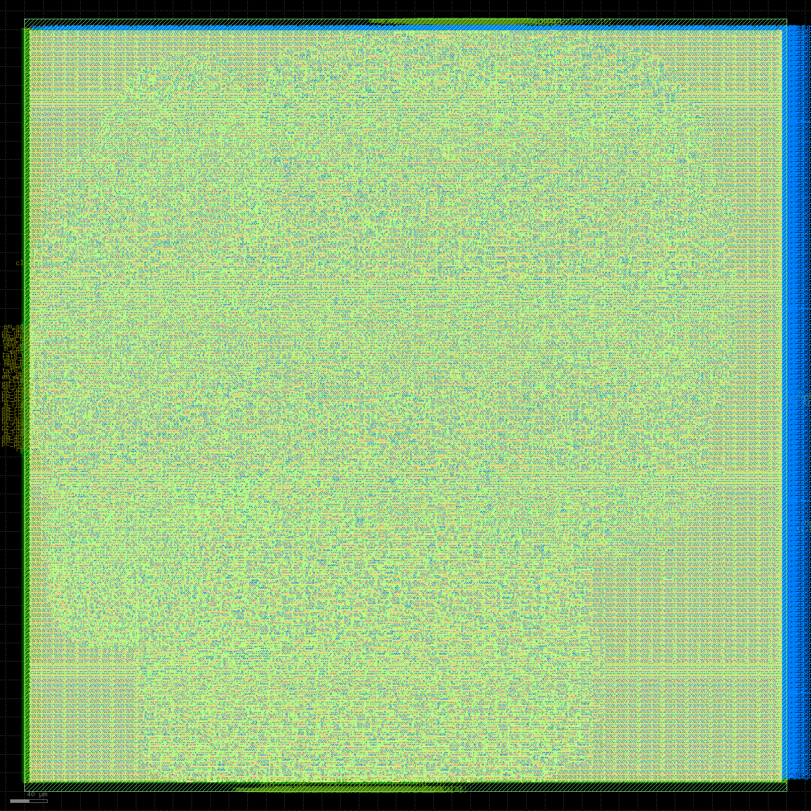
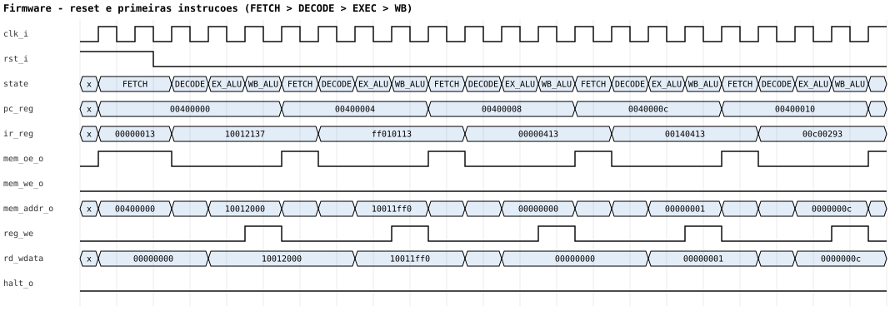

# RV32I · Zmmul · Xicrc — um processador RISC-V do RTL ao silício


Microcontrolador RISC-V de 32 bits com núcleo **multicycle**, desenvolvido para a
**Fase 2 da ChampionCHIP eXperience** e levado do Verilog até o **GDSII** no
processo **SkyWater SKY130** (130 nm) com o OpenLane 2.

| | |
|---|---|
| **ISA** | **44/47** instruções fechadas: RV32I 40/40 · Zmmul 4/4 · Xicrc 0/3 (bloqueada por especificação, ver [lacunas](#lacunas-do-guia-oficial)) |
| **Verificação** | 14/14 suítes · 20 programas aleatórios idênticos a um modelo de referência independente · **mutation score 13/13** |
| **Gate-level** | netlists pós-layout (baseline e otimizada) equivalentes ao modelo de referência |
| **Físico** | **DRC 0 · LVS 0**, timing fechado nos 9 corners a **33,3 MHz** (folga de +1,14 ns no pior corner) |
| **Área / potência** | die de 0,68 mm² (820 × 831 µm) · 46,8 mil células · 42,6 mW estimados |

<p align="center">
  
</p>



## O que tem aqui

| Pasta | Conteúdo |
|---|---|
| [`rtl/`](rtl/) | Núcleo (regfile, ALU, imm_gen, branch_cmp, mult_unit, crc_unit, lsu, control_unit, rv32_core), memórias e tops |
| [`tb/`](tb/) | 8 testbenches unitários, 4 de ISA, firmware e o teste diferencial randomizado |
| [`firmware/`](firmware/) | Firmware de smoke-test, linker script e build |
| [`openlane/`](openlane/) | Configurações do OpenLane (baseline 40 ns e otimizada 30 ns) e SDC |
| [`tools/`](tools/) | Modelo de referência (ISS), gerador de programas aleatórios, teste de mutação, waveforms, relatórios, dashboard, notebooks, apresentação, Docker |
| [`scripts/`](scripts/) | Um script por etapa, portável entre Windows, Linux e CI |
| [`notebooks/`](notebooks/) | Jupyter: pipeline completo e um notebook por etapa |
| [`dashboard/`](dashboard/) | Painel HTML autocontido com todas as evidências (abre offline) |
| [`reports/`](reports/) | Resumos gerados: `summary.json`, `RESUMO.md`, regressão, mutação, gate-level, sweep físico |
| [`docs/`](docs/) | Relatório, arquitetura, governança, evidências, plano, guia oficial e material do vídeo |
| [`versioning/`](versioning/) | `CHANGELOG`, histórico cronológico e **registro mestre** do projeto |

Comece pelo [**registro mestre**](versioning/REGISTRO_MESTRE.md): ele liga cada requisito do
guia à evidência que o comprova.

## Como rodar

Pré-requisito: Docker. A imagem traz Icarus Verilog, Verilator, Yosys, GCC RISC-V e OpenLane 2.

```bash
make build-image      # uma vez
make lint             # lint sintetizável (Verilator -Wall)
make test             # unit + ISA + firmware + 20 programas aleatórios vs modelo de referência
make mutation         # injeta 13 bugs e mede se a verificação detecta cada um
make openlane         # RTL -> GDSII, baseline 40 ns (~50 min; baixa o PDK na 1a vez)
make openlane-opt     # RTL -> GDSII otimizado, 30 ns
make gls              # simulação gate-level da netlist pós-layout
make dashboard        # gera dashboard/index.html a partir dos resultados
```

Sem `make`, chame os scripts direto (`bash scripts/run_regression.sh` etc.).

- **Linux/macOS:** o projeto é montado direto no container.
- **Windows (Git Bash):** os scripts espelham as fontes em `C:/tmp/championchip-build`,
  porque o Docker Desktop não monta pastas sincronizadas (Google Drive/OneDrive).
- **Sem Docker:** com as ferramentas instaladas, use `CHAMPIONCHIP_NATIVE=1`
  (é assim que o [CI](.github/workflows/ci.yml) roda a cada push).

## Verificação

1. **Testes unitários** — um testbench por bloco.
2. **Testes por instrução** — as 44 instruções no SoC, com scoreboard no banco de registradores.
   Encontraram **dois bugs reais** de PC em JAL/JALR ([ADR-003](docs/governance/DECISIONS.md)).
3. **Firmware** — compilado com `riscv64-unknown-elf-gcc -march=rv32im`, grava a assinatura
   `0x600DC0DE` e executa EBREAK.
4. **Diferencial randomizado** — programas aleatórios no RTL e num simulador de instruções
   em Python escrito a partir da especificação ([`tools/iss/`](tools/iss/)).
5. **Teste de mutação** — 13 bugs realistas injetados; todos detectados. O processo revelou
   e corrigiu duas lacunas do próprio gerador de testes ([ADR-014](docs/governance/DECISIONS.md)).
6. **Gate-level** — a netlist do OpenLane roda o firmware e os programas aleatórios.

## Documentação

- [Relatório técnico](docs/submission/RELATORIO.md) · [Arquitetura](docs/architecture/overview.md)
- [Decisões (ADRs)](docs/governance/DECISIONS.md) · [Lacunas do guia](docs/governance/SPEC_GAPS.md) ·
  [Problemas conhecidos](docs/governance/KNOWN_ISSUES.md) · [Matriz de testes](docs/governance/TEST_MATRIX.csv) ·
  [Status](docs/governance/STATUS.md)
- [Changelog](versioning/CHANGELOG.md) · [Histórico](versioning/HISTORICO.md) · [Registro mestre](versioning/REGISTRO_MESTRE.md)
- [Plano Mestre de engenharia](docs/planning/Plano_Mestre_ChampionCHIP_Fase2.pdf) · [Guia oficial](docs/reference/Champion-chip-guia-fase-2.pdf)
- [Apresentação](docs/video/Apresentacao_ChampionCHIP.pptx) · [Roteiro do vídeo](docs/video/ROTEIRO_VIDEO.md)

## Lacunas do guia oficial

O guia não especifica cinco pontos. Nenhum foi preenchido por suposição: cada um está isolado
no código e documentado em [`SPEC_GAPS.md`](docs/governance/SPEC_GAPS.md).

| | Lacuna | Situação |
|---|---|---|
| SG-01 | Parâmetros do CRC (Xicrc) | unidade pronta e parametrizada, aguardando os parâmetros oficiais |
| SG-02 | Macro física das memórias | modelos de simulação; o núcleo foi fechado fisicamente sozinho |
| SG-03 | Pinagem GPIO/serial | pinos reservados com tie-off seguro |
| SG-04 | Polaridade do reset | ativo-alto (padrão SKY130), a confirmar |
| SG-05 | Firmware oficial | firmware autoral usado como evidência interina |

Os binários pesados do layout (GDS, netlists) não são versionados; são reproduzidos por
`make openlane` / `make openlane-opt` e distribuídos no pacote de entrega.
