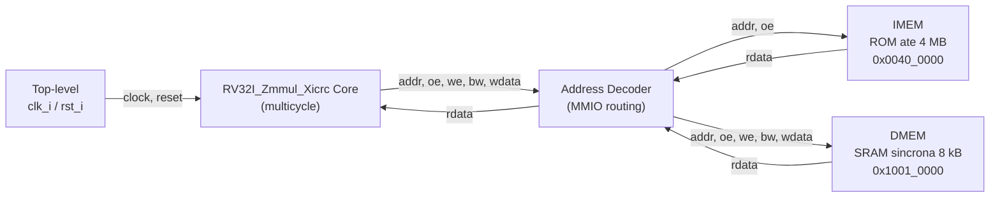
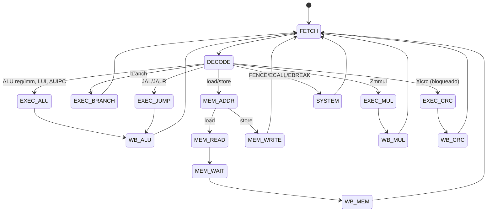

# Arquitetura — RV32I_Zmmul_Xicrc

## Sistema

## FSM (16 estados)

`MEM_WAIT` existe porque a DMEM é explicitamente síncrona no guia oficial —
a leitura só fica disponível um ciclo depois do `oe`.

## Registradores de estágio

- `pc_reg`, `ir_reg` — write-enable explícito, centralizado em
  `control_unit.sv` (ver `DECISIONS.md` ADR-003 para o bug de PC duplicado
  encontrado e corrigido em JAL/JALR).
- `alu_out_reg`, `mult_out_reg`, `crc_out_reg`, `link_reg` — "free-running"
  (sem enable dedicado), estilo ALUOut/MDR clássico (ADR-002).

## Ver também

- [`../../README.md`](../../README.md) — visão geral e status
- [`../submission/RELATORIO.md`](../submission/RELATORIO.md) — relatório técnico completo
- [`../../notebooks/`](../../notebooks/) — notebooks executáveis (pipeline completo e por etapa)
